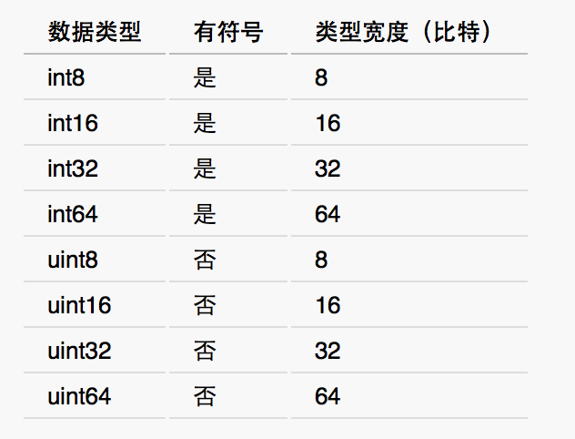
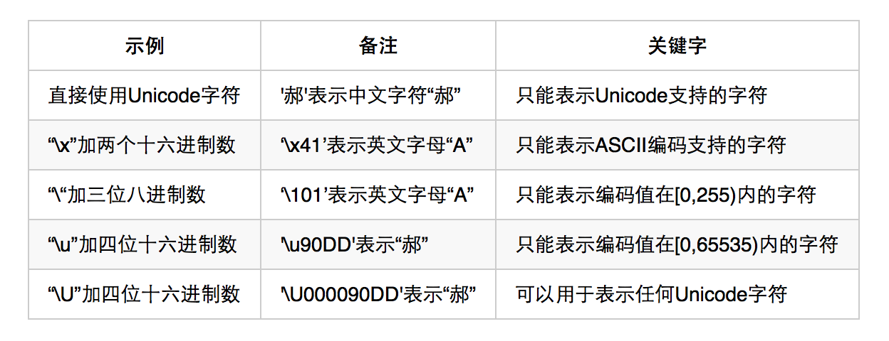
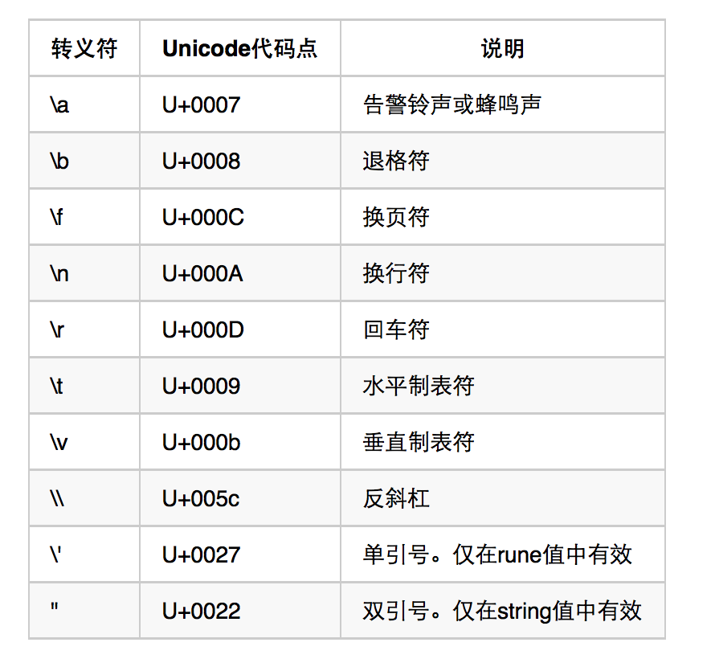

## Go语言的优势

* 脚本化的语法   
* 静态类型+编译型，程序运行速度有保障    
* go语言支持 **函数式** 和 **面向对象** 编程   
* 原生支持并发编程：这使得go语言在服务器端软件开发更有优势，降低开发，维护成本；程序可以更好地执行   

## Go语言的劣势   

* go语言并没有Python和ruby那么多语法糖   
* go语言开发的程序运行速度目前还不及C    
* go语言第三方函数库暂时还不像主流的编程语言那么多    


## Go语言的安装与设置  

go语言在Linux、Windows和Mac上的安装参见go语言[官方安装](https://golang.org/doc/install)说明;这里不再赘述    

go语言设置：
* `GOROOT`-go语言的当前安装目录   
    export GOROOT=/usr/local/go   
* `GOPATH`-go语言工作区的集合(go源码文件目录)    
    export GOPATH=~/golib:~/goproject    
* `GOBIN`-存放go编译后的可执行文件目录,    
    export GOBIN=~/gobin   
* `PATH`- 为方便使用Go语言命令和Go程序的可执行文件，需要追加其值到环境变量中    
    export PATH=$PATH:$GOROOT/bin:$GOBIN     

## 工作区和PATH

GOPATH：工作区集合，存放go源码文件    

      

src: 用于存放源码文件，以代码包为组织形式    
pkg: 用于存放归档文件(名称以 .a 为后缀的文件)    
    
bin: 存放当前工作区中的Go程序的可执行文件,**当设置了`GOBIN`或者`GOPATH`设置多个工作区时(必须设置GOBIN)，本目录将失去其意义**    

## 源码文件的分类和含义   

* Go源码文件，名称以 `.go` 为后缀，内容就是go语言代码；多个文件需要用代码包组织起来的          
* Go源码文件分为三类：命令源码文件，库源码文件，测试源码文件    
> 命令源码文件：声明属于main包，并包含一个人没有参数声明和结果返回的main函数。命令源码文件被`go install`安装后会被放在工作区下的bin目录中（如果有多个工作目录就会放在`GOBIN`指定的目录下）    
> 库源码文件：不具备上述命令文件两点特征的源码文件，库源码文件安装后相应的归档文件会被存放在：工作区目录/pkg/<平台相关目录>/
> 测试源码文件：测试源码文件名以`_test.go`为后缀，测试源码文件至少包含一个函数名称以 `Test` 或 `Benchmark` 为前缀， 该函数接受一个类型为 `*testing.T` 或 `*testing.B`的指针类型参数      

## 代码包

* 代码包作用：编译和归档Go程序的基本单位。代码划分，集结和依赖的有效组织形式     
* 代码包规则：代码包实际上就是一个由导入路径代表的目录：<工作区目录>/src 或 <工作区目录>/pkg/<平台相关目录>/ 之下的某段子目录       
* 代码包声明：每个源码文件都应该声明其所属的代码包；同一个代码包中的文件声明的代码包都应该是相同的；代码包名称应该是代码包导入路径中最右子路径     
* 代码包导入：代码包导入语句中应该写全，即应该与导入路径一致；
    > 带别名导入代码包：`import str "strings"`   
    > 本地化导入代码包: `import . "strings"`     
    > 仅仅初始化： `import _ "strings"` - 仅执行代码包中的初始化函数：没有参数声明也没有结果声明的 `init` 函数，init函数可以被声明在任何文件中，且可以有多个，每个init只会被执行一次               

## 程序实体与权限控制
在Go语言中，变量、常量、函数、结构体和接口被统称为“程序实体”，而它们的名字被统称为“标识符”。标识符可以是任何Unicode编码可以表示的字母字符、数字以及下划线`_`。不过，首字母不能是数字或下划线。  

在Go语言中，我们对程序实体的访问权限控制只能通过它们的名字来实现。名字首字母为大写的程序实体可以被任何代码包中的代码访问到。而名字首字母为小写的程序实体则只能被同一个代码包中的代码所访问    

## 变量和常量  

* 声明变量的关键字 `var`，声明常量的关键字 `const`       
* 变量和常量在声明方式方面也有所不同。我们可以在声明一个变量的时候直接为它赋值，也可以只声明不赋值。但是要注意，对于常量不能出现只声明不赋值的情况。
* 变量和常量都可以以一下三种方式声明（注意：常量不能出现只声明不赋值）：
```go
// 注释：普通赋值，由关键字var、变量名称、变量类型、特殊标记=，以及相应的值组成。
// 若只声明不赋值，则去除最后两个组成部分即可。
var num1 int = 1
```
或     
```go
var num2, num3 int = 2, 3 // 注释：平行赋值  
```
或       
```go
var ( // 注释：多行赋值
    num4 int = 4
    num5 int = 5
)
```

## 整数类型的命名和宽度  

Go语言的整数类型一共有10个，其中计算架构相关的整数类型有两个，即：有符号的整数类型int和无符号的整数类型uint。
   
除了这两个计算架构相关的整数类型之外，还有8个可以显式表达自身宽度的整数类型。如下表所示    
   

## 浮点数类型  
Go语言中浮点数类型有: `float32`和`float64`; 浮点数类型的值一般由整数部分、小数点“.”和小数部分组成。    
浮点数有两种表示方法：整数部分和小数部分均由10进制表示法表示（一般计数）；另一种表示方法是：在其中加入指数部分。指数部分由“E”或“e”以及一个带正负号的10进制数组成（科学计数法）。比如，`3.7E-2` 表示浮点数 `0.037`     
** 注意，在Go语言里，浮点数的相关部分只能由10进制表示法表示，而不能由8进制表示法或16进制表示法表示。比如，`03.7`表示的一定是浮点数`3.7`。**       

## 复数类型
复数类型同样有两个，即`complex64`和`complex128`。存储这两个类型的值的空间分别需要8个字节和16个字节。实际上，`complex64`类型的值会由两个`float32`类型的值分别表示复数的实数部分和虚数部分。而`complex128`类型的值会由两个`float64`类型的值分别表示复数的实数部分和虚数部分。    

复数类型的值一般由浮点数表示的实数部分、加号“+”、浮点数表示的虚数部分，以及小写字母“i”组成。比如，`3.7E+1 + 5.98E-2i`。正因为复数类型的值由两个浮点数类型值组成，所以其表示法的规则自然需遵从浮点数类型的值表示法的相关规则。我们就不在这里赘述了。请你通过练习题来回顾一下相关表示法的规则。     

## byte与rune
Go预言中byte与rune类型分别是`uint8`和`int32`的别名，`byte`比较简单，这里重点说：`rune`类型的值需要由单引号“'”包裹。例如，'A'或'郝'。这种表示方法一目了然。不过，我们还可以用另外几种形式表示rune类型值。请看下表      

另外，在rune类型值的表示中支持几种特殊的字符序列，即：转义符。它们由“\”和一个单个英文字符组成。如下表所示      


## 字符串
Go语言中一个字符串类型的值可以代表一个字符序列。这些字符必须是被Unicode编码规范支持的。     
字符串的表示法有两种，即：原生表示法和解释型表示法。若用原生表示法，需用反引号“`”把字符序列包裹起来。若用解释型表示法，则需用双引号“"”包裹字符序列；二者的区别是，前者表示的值是所见即所得的（除了回车符）。在那对反引号之间的内容就是该字符串值本身。而后者所表示的值中的转义符会起作用并在程序编译期间被转义。

## 数组   
